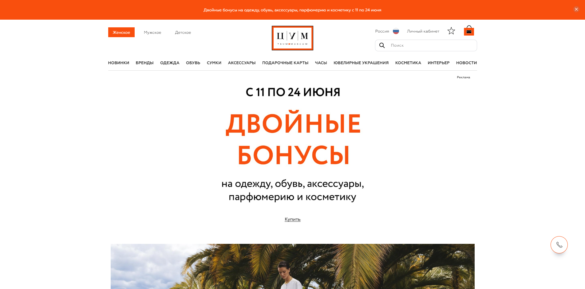
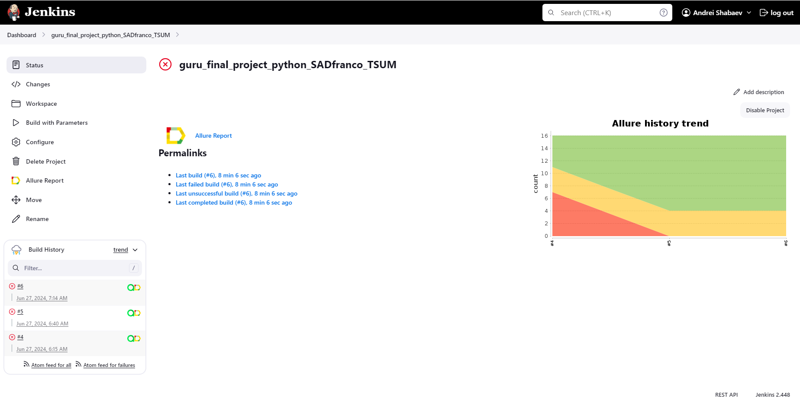
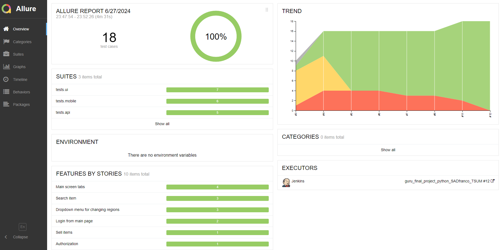
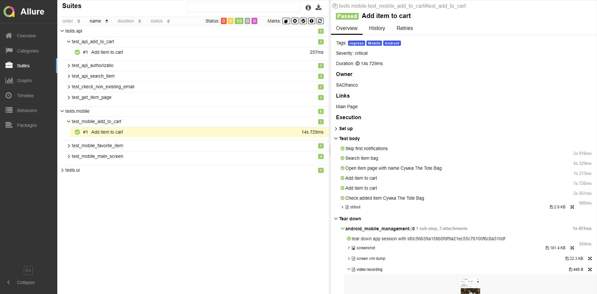
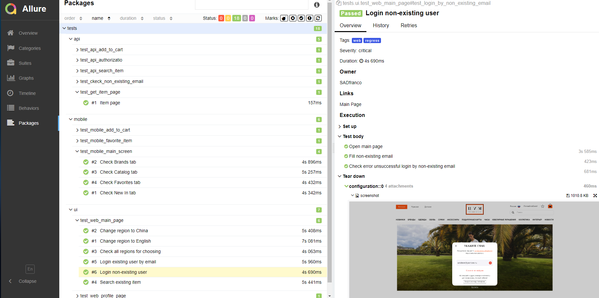
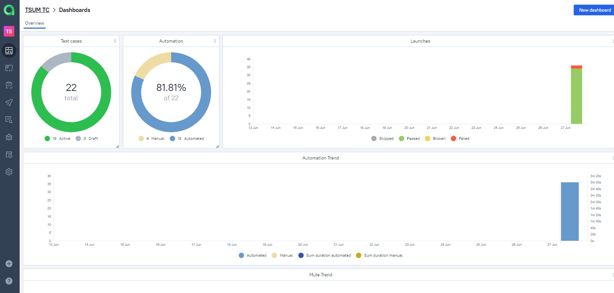
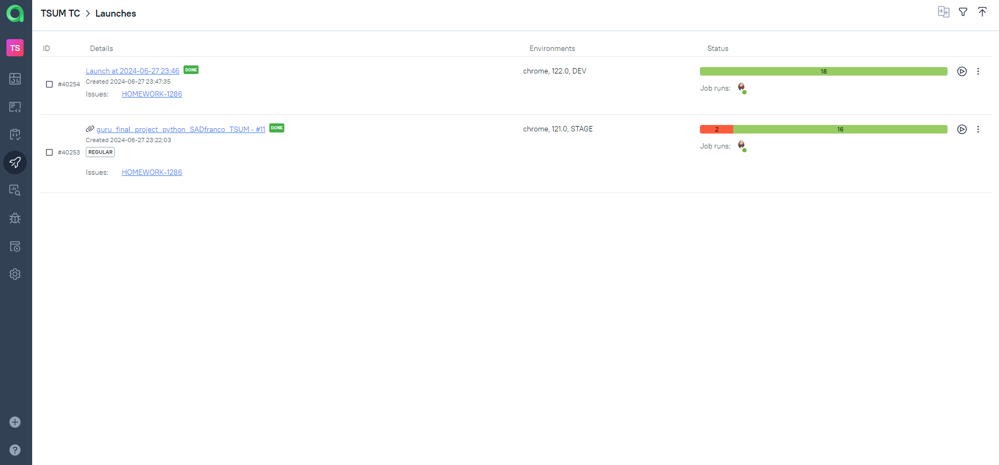
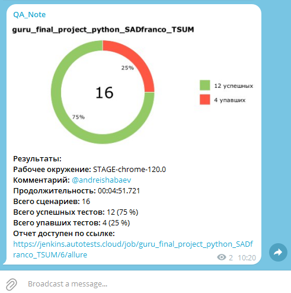
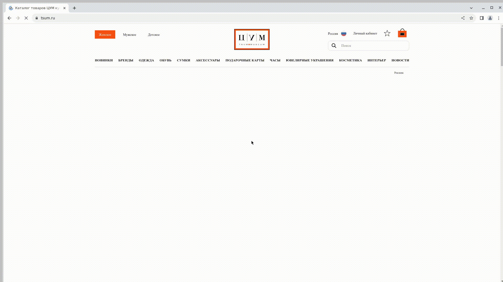

<h1> Testing online store TSUM</h1>

> <a target="_blank" href="https://www.tsum.ru/">Ссылка на сайт</a>

<!-- Tools -->

### USING TOOLS

  <code></code>
  <code></code>
  <code></code>
  <code></code>
  <code></code>
  <code></code>
  <code></code>
  <code></code>
  <code></code>
  <code></code>
  <code></code>
  <code></code>
  <code></code>
  <code></code>

<!-- Test Cases -->

### Test cases

WEB:
* ✅ Change region and language
* ✅ Check dropdown menu with regions
* ✅ Search item  
* ✅ Login existing user by email 
* ✅ Login user by non-existing email
* ✅ Check profile left menu 
* ✅ Logout from profile

MOBILE:
* ✅ Check tabs menu and title on main screen
* ✅ Search item  
* ✅ Add item to the favorite list
* ✅ Add item to the cart

API:
* ✅ Search item
* ✅ Add item to the cart
* ✅ Get items page
* ✅ Login existing user by email
* ✅ Login non existing user by email

<!-- Jenkins -->

###  Launch project on Jenkins

### [Task on Jenkins](https://jenkins.autotests.cloud/job/guru_final_project_python_SADfranco_TSUM)

##### You can choose parameters before starting a build in the menu "Build with parameters". You can add stand, comment, browser version. When you start the build, it launches testing on Selenoid machine.

<!-- Allure report -->

###  Allure report

### [Allure reports](https://jenkins.autotests.cloud/job/guru_final_project_python_SADfranco_TSUM/5/allure/#)

##### When automation executing tests finish, you can check results on Allure reports. The report link is on Jenkins page

##### There are information about testing duration, tests status and tests severity.

##### There are testing steps with descriptions, logs, screenshots and video on Suites page.

##### There are testing steps with descriptions, logs, screenshots and video on Packages page.

<!-- Allure TestOps -->

###  Integration with Allure TestOps

### [Dashboard](https://allure.autotests.cloud/project/4303/dashboards)

##### All reports save to Allure TestOps, where you can see executing graphics.

#### There are all automation test cases with steps on Suites page:

#### There are all tests runs (local or started from Jenkins) with build parameters on Launches page:

<!-- Jira -->

###  Integration with Jira
##### When you create integration with Jira, you can add test cases and runs directly to Jira task

<!-- Telegram -->

###  Integration with Telegram
##### When all tests finish, the notification will be sent to Telegram with running test results.

##### Video executing test (Successful login user)
